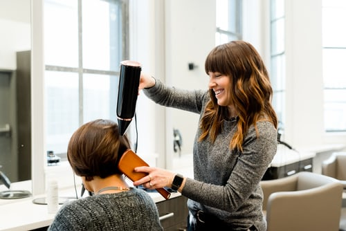

<h1 align="center">Projeto Salon</h1>

## Descrição do Projeto

Projeto NLW onde fizemos um site de salon para beleza.

<h2>Conteúdo do projeto</h2>

<ul>
  <li>HTML</li>
  <li>CSS</li>
  <li>JAVASCRIPT</li>
</ul>

<h3>Apresentação do site</h3>

 
 
 
 <h2 class="title">Saúde natural para os seus cabelos</h2>
            

              Um salão exclusivo em São Paulo, especializado em tratamentos
              naturais.
            

          

        

        
 
 
 <h2 class="title">Sobre nós</h2>
            

              A beautysalon está no mercado a 10 anos onde a empresa além de tomar o maior cuidado aos seus clientes tem a maior alta de qualidade nos seus serviços e seus profissionais tem a maior nota pelo serviços prestados.
              O setor de beleza no Brasil é um dos mais promissores e que mais cresce no país. 
              Hoje em dia, a população apresenta alta demanda por produtos e serviços de qualidade e procedimentos específicos que contribuam com a elevação da autoestima e do bem estar e atendam necessidades de higiene pessoal.
              
            

            
            
 
              Por isso, o Brasil é hoje um dos principais players globais em relação ao mercado de salões de beleza, mesmo diante cenários econômicos de crise nos anos        recentes, está em 4º lugar no ranking mundial. 
              Segundo o IBGE, o brasileiro gasta mais com beleza do que com comida. 
              Então, este é, sem dúvidas, um dos melhores ramos para se investir atualmente.
           

         
         
         
         
        
        
         
  
  
      

          
